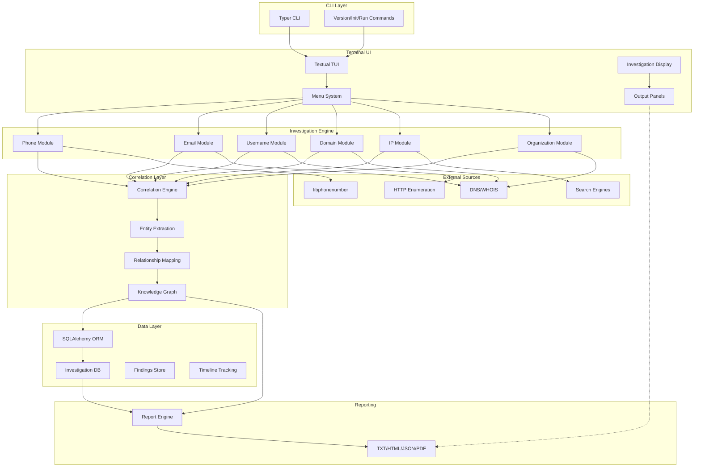
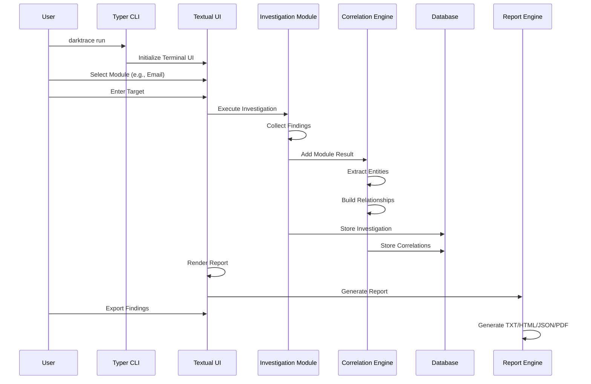

# DarkTrace X

<div align="center">


---

### 🎯 Transforming Public Intelligence into Actionable Investigations

**DarkTrace X** is a professional-grade cyber intelligence and OSINT correlation platform designed for security researchers, threat intelligence teams, SOC analysts, and DFIR investigators.

```
╔═══════════════════════════════════════════════════════════════════╗
║                                                                   ║
║   ██████╗  █████╗ ██████╗ ██╗  ██╗████████╗██████╗  █████╗  ██████╗
║   ██╔══██╗██╔══██╗██╔══██╗██║ ██╔╝╚══██╔══╝██╔══██╗██╔══██╗██╔════╝
║   ██║  ██║███████║██████╔╝█████╔╝    ██║   ██████╔╝███████║██║
║   ██║  ██║██╔══██║██╔══██╗██╔═██╗    ██║   ██╔══██╗██╔══██║██║
║   ██████╔╝██║  ██║██║  ██║██║  ██╗   ██║   ██║  ██║██║  ██║╚██████╗
║   ╚═════╝ ╚═╝  ╚═╝╚═╝  ╚═╝╚═╝  ╚═╝   ╚═╝   ╚═╝  ╚═╝╚═╝  ╚═╝ ╚═════╝
║                                                                   ║
║                     PROFESSIONAL CYBER INTELLIGENCE              ║
║                   OSINT • DFIR • Threat Intelligence              ║
║                       Correlation Engine                         ║
║                                                                   ║
║            🇮🇳 MADE IN INDIA — Built by Darkscripters™           ║
║                                                                   ║
╚═══════════════════════════════════════════════════════════════════╝
```

</div>

---

## 📋 Table of Contents

- [Overview](#overview)
- [Features](#-features)
- [Supported Investigations](#-supported-investigations)
- [Architecture](#-architecture)
- [Correlation Engine](#-correlation-engine)
- [Installation](#-installation)
- [Quick Start](#-quick-start)
- [Project Structure](#-project-structure)
- [Tech Stack](#-tech-stack)
- [Roadmap](#-roadmap)
- [Contributing](#-contributing)
- [Security & Disclaimer](#-security--disclaimer)
- [License](#-license)

---

## 📖 Overview

### What is DarkTrace X?

DarkTrace X is a **professional-grade cyber intelligence and OSINT correlation platform** that transforms publicly available information into actionable intelligence. It automates the discovery, correlation, and analysis of digital identities, infrastructure, and organizational footprints across multiple data sources.

### Why It Exists

Traditional OSINT tools operate in silos—they investigate individual entities without connecting the intelligence dots. DarkTrace X solves this by:

- **Linking entities across domains** (emails → domains → organizations → infrastructure)
- **Building knowledge graphs** of relationships and correlations
- **Automating tedious reconnaissance workflows** used by security researchers and threat hunters
- **Generating professional reports** with evidence chains and confidence scoring

### The Problem It Solves

Security researchers and threat intelligence analysts waste hours manually:

- Searching for usernames across multiple platforms
- Extracting email addresses and associating them with domains
- Correlating organizational infrastructure
- Building timelines of discovered intelligence
- Creating evidence-backed reports

DarkTrace X automates these workflows with a professional terminal interface and correlation engine.

### How It Differs

| Feature | DarkTrace X | Traditional OSINT | Manual Research |
|---------|-----------|------------------|-----------------|
| **Correlation** | Automated entity linking | Limited | Manual |
| **Knowledge Graph** | Built-in NetworkX graph | Separate tool | Spreadsheets |
| **Evidence Chain** | Automatic tracking | Manual notes | Scattered docs |
| **Timeline** | Automatic reconstruction | Manual | Manual |
| **Risk Scoring** | Confidence-based | No scoring | Subjective |
| **Professional Reports** | TXT, HTML, JSON, PDF | Varies | Documents |
| **Plugin Framework** | Yes | No | N/A |

---

## 🚀 Features

### Core Investigation Modules

| Module | Purpose | Capabilities | Outputs |
|--------|---------|--------------|---------|
| **Phone Intelligence** | Analyze phone numbers | Format validation, carrier detection, geolocation, timezone, public references | Metadata, risk score, correlations |
| **Email Intelligence** | Email analysis | Syntax validation, MX records, domain analysis, public references | Domain intelligence, exposure indicators |
| **Username Intelligence** | Cross-platform enumeration | Multi-platform detection, variation testing, correlation analysis | Platform presence, reuse risk |
| **Domain Intelligence** | Domain reconnaissance | WHOIS, DNS, SSL certificates, subdomains, public references | Infrastructure, exposure analysis |
| **IP Intelligence** | IP address analysis | Reverse DNS, ASN lookup, geolocation, threat categorization | Network intelligence, risk assessment |
| **Organization Intelligence** | Organization mapping | Domain discovery, certificate mapping, technology footprint | Infrastructure mapping, exposure surface |
| **Website Intelligence** | Website fingerprinting | Technology stack, security headers, public information | Technology profile |

### Advanced Features

- 🔗 **Correlation Engine** — Automatic entity linking across investigation modules
- 📊 **Knowledge Graph** — NetworkX-based relationship mapping with confidence scoring
- 📈 **Risk Scoring** — Confidence-based assessment of findings and overall investigation risk
- 📋 **Timeline Reconstruction** — Chronological ordering of discovered intelligence
- 🔌 **Plugin Framework** — Extend DarkTrace X with custom modules
- 📝 **Professional Reporting** — Export findings in TXT, HTML, JSON, PDF formats
- 🎨 **Terminal UI** — Rich, responsive Textual interface for terminal-based investigation
- 💾 **Evidence Persistence** — SQLAlchemy-based database for investigation tracking

---

## 🎯 Supported Investigations

| Input Type | Example | Capabilities |
|-----------|---------|--------------|
| **Phone Number** | +1-202-555-0173 | Validation, carrier, geolocation, timezone, public references |
| **Email Address** | user@example.com | Domain analysis, MX validation, public search, organization extraction |
| **Username** | john_developer | Multi-platform enumeration, variation detection, cross-platform correlation |
| **Domain Name** | example.com | WHOIS, DNS, SSL, subdomains, technology fingerprinting, infrastructure |
| **IP Address** | 203.0.113.45 | Reverse DNS, ASN, geolocation, hosting provider, threat classification |
| **Organization** | Acme Corp | Domain discovery, certificate mapping, technology footprint, infrastructure |
| **Website URL** | https://example.com | Technology stack, security headers, public information, exposure |
| **Social Profile** | @username | Profile enumeration, cross-platform correlation |

---

## 🏗️ Architecture

### System Architecture



### Investigation Flow



---

## 🔗 Correlation Engine

### Entity Linking

DarkTrace X automatically connects entities across investigation modules:

```
📱 Phone Number
    ↓
🔍 Extract Username → Username Intelligence
    ↓
🌐 Find on GitHub, Reddit, etc.
    ↓
📧 Extract Email → Email Intelligence
    ↓
🏢 Extract Domain → Domain Intelligence
    ↓
🗺️ Extract IP → IP Intelligence
    ↓
🏭 Extract Organization → Organization Intelligence
    ↓
📊 Build Knowledge Graph
```

### Correlation Features

| Feature | Description | Confidence |
|---------|-------------|-----------|
| **Email→Domain** | Extracts domain from email address | 98% |
| **Username→Platform** | Detects username across platforms | 85%+ |
| **Domain→IP** | Resolves domain infrastructure | 90% |
| **Organization→Domain** | Maps organization to domains | 80% |
| **Shared Infrastructure** | Identifies shared IP/hosting | 85% |
| **Cross-Platform Identity** | Links same identity across platforms | 90% |

### Knowledge Graph Output

The correlation engine generates a NetworkX graph with:

- **Entity Nodes** — Discovered entities (emails, domains, IPs, usernames, organizations)
- **Relationship Edges** — Types: email_domain, shared_infrastructure, organization_domain, cross_platform, reference
- **Confidence Scoring** — Each relationship includes confidence metrics
- **Timeline Integration** — Events tied to discovery timestamp
- **Evidence Chain** — Source attribution for each correlation

---

## 💾 Installation

### Prerequisites

- **Python** 3.10 or higher
- **Git**
- **Linux, macOS, or Windows** with terminal support

### Linux Installation

#### Ubuntu / Debian

```bash
# Clone repository
git clone https://github.com/darkscripters/darktracex.git
cd darktracex

# Update system
sudo apt update
sudo apt install -y python3-pip python3-venv

# Create virtual environment
python3 -m venv venv
source venv/bin/activate

# Install dependencies
pip install --upgrade pip
pip install -r requirements.txt

# Editable install
pip install -e .

# Initialize database
darktrace init

# Run DarkTrace X
darktrace run
```

#### Kali Linux

```bash
git clone https://github.com/darkscripters/darktracex.git
cd darktracex
python3 -m venv venv
source venv/bin/activate
pip install -r requirements.txt
pip install -e .
darktrace init
darktrace run
```

#### Arch Linux

```bash
sudo pacman -S python python-pip
git clone https://github.com/darkscripters/darktracex.git
cd darktracex
python -m venv venv
source venv/bin/activate
pip install -r requirements.txt
pip install -e .
darktrace init
darktrace run
```

### macOS Installation

```bash
# Install Homebrew (if not installed)
/bin/bash -c "$(curl -fsSL https://raw.githubusercontent.com/Homebrew/install/HEAD/install.sh)"

# Install Python
brew install python

# Clone and setup
git clone https://github.com/darkscripters/darktracex.git
cd darktracex
python3 -m venv venv
source venv/bin/activate
pip install -r requirements.txt
pip install -e .
darktrace init
darktrace run
```

### Windows Installation

```powershell
# Open PowerShell as Administrator

# Install Python from python.org or use Windows Package Manager
# Then:

git clone https://github.com/darkscripters/darktracex.git
cd darktracex
python -m venv venv
.\venv\Scripts\Activate.ps1
pip install -r requirements.txt
pip install -e .
darktrace init
darktrace run
```

### Docker Installation (Optional)

```bash
# Build Docker image
docker build -t darktracex .

# Run DarkTrace X
docker run -it --rm darktracex darktrace run
```

---

## ⚡ Quick Start

### Initialize DarkTrace X

```bash
darktrace init
```

### Launch Terminal Interface

```bash
darktrace run
```

### Menu Navigation

1. Select investigation module (Phone, Email, Domain, etc.)
2. Enter target (phone number, email, domain, etc.)
3. Click "Run Investigation"
4. Review findings and correlations
5. Export report (Press 'q' to exit)

### CLI Commands

#### Version Information

```bash
darktrace version
```

Output:
```
╭────────────────────────╮
│ DarkTrace X 1.0.0      │
│ Python CLI Intelligence OS │
╰────────────────────────╯
```

#### Initialize Configuration

```bash
darktrace init
```

#### Launch Interactive UI

```bash
darktrace run
```

### Example Investigations

#### Phone Number Investigation

```
Target: +1-202-555-0173
Module: Phone Intelligence

Results:
  ✓ Valid number format
  ✓ Country: United States (US)
  ✓ Region: Washington, DC
  ✓ Carrier: Verizon Communications
  ✓ Number Type: Mobile
  ✓ Timezone: America/New_York
```

#### Email Investigation

```
Target: security@example.com
Module: Email Intelligence

Results:
  ✓ Email format valid
  ✓ Domain: example.com
  ✓ MX Records: mail.example.com
  ✓ Organization: Example Corp
  ✓ WHOIS: Registered to Example Inc.
  ✓ Public References: Found in search results
```

#### Username Investigation

```
Target: john_developer
Module: Username Intelligence

Results:
  ✓ GitHub: Found
  ✓ Reddit: Found
  ✓ Medium: Found
  ✓ StackOverflow: Found
  ✓ Cross-Platform Risk: HIGH (4 platforms)
  ✓ Variations: john_developer123, john.developer
```

#### Domain Investigation

```
Target: example.com
Module: Domain Intelligence

Results:
  ✓ WHOIS: Registered 2020-01-15
  ✓ Registrar: GoDaddy
  ✓ DNS: A, AAAA, MX, NS records resolved
  ✓ SSL: Valid certificate (DigiCert)
  ✓ Subdomains: 5 discovered
  ✓ Certificate Transparency: 12 entries
```

#### IP Investigation

```
Target: 203.0.113.45
Module: IP Intelligence

Results:
  ✓ Valid IPv4 address
  ✓ Reverse DNS: server.example.com
  ✓ Geolocation: San Francisco, CA, USA
  ✓ ASN: AS14061 (DigitalOcean)
  ✓ Classification: Cloud Provider
  ✓ Risk Score: 0.45 (Medium)
```

---

## 📊 Screenshots

### Terminal Interface

```
┌─────────────────────────────────────────────────────────┐
│ DarkTrace X - Cyber Intelligence Platform              │
├─────────────────────────────────────────────────────────┤
│ Workspace: /home/user/.darktracex | Plugins: 2        │
├──────────────────┬──────────────────────────────────────┤
│ Main Menu        │ Status: Ready                        │
│ ─────────────    │ Module: Email                        │
│ Phone Number     │ Active: 0                            │
│ Email Address    │ Plugins: 2                           │
│ Domain           │                                      │
│ IP Address       │ Investigation Output                 │
│ Organization     ├──────────────────────────────────────┤
│ Website          │ [✓] Email investigation starting    │
│ Social Profile   │ [✓] Validating format               │
│ Settings         │ [✓] DNS lookups completed           │
│ Exit             │ [✓] Found 3 findings               │
│                  │ [✓] Correlations built              │
│ [Enter target]   │                                      │
│ [Run Investigation]│                                     │
└──────────────────┴──────────────────────────────────────┘
```

### Investigation Results

```
════════════════════════════════════════════════════════════
EXECUTIVE SUMMARY
════════════════════════════════════════════════════════════

Target: security@example.com
Module: Email Intelligence
Findings: 5
Timeline events: 8
Highest confidence finding: Domain ownership (0.88)

════════════════════════════════════════════════════════════
FINDING #1
════════════════════════════════════════════════════════════

Category:
Email Validation

Title:
Email address format validation

Source:
validators library

Confidence:
0.98

Details:
Email address is valid. Syntax conforms to RFC 5322 standards.
```

### Knowledge Graph Visualization

Interactive NetworkX graph showing entity relationships:

```
         [organization]
              ↓
          [domain]
         ↙        ↘
    [ip]        [email]
         ↖        ↙
        [username]
              ↓
          [platforms]
```

### Timeline View

```
[✓] 2024-01-15 10:23:45 — Email validation started
[✓] 2024-01-15 10:23:46 — DNS MX records retrieved
[✓] 2024-01-15 10:23:47 — WHOIS lookup completed
[✓] 2024-01-15 10:23:48 — Organization extracted
[✓] 2024-01-15 10:23:49 — Correlations calculated
[✓] 2024-01-15 10:23:50 — Report generated
```

---

## 📝 Reporting

### Supported Export Formats

| Format | Features | Use Case |
|--------|----------|----------|
| **TXT** | Plain text, structured sections | Quick sharing, archival |
| **HTML** | Styled, responsive, interactive | Email distribution, web viewing |
| **JSON** | Machine-readable, all metadata | Automation, integration |
| **PDF** | Professional, print-ready, signed | Official reports, deliverables |
| **CSV** | Tabular findings, spreadsheet | Analysis, filtering |

### Report Contents

- Executive Summary
- Investigation Metadata
- Timeline (chronological)
- Individual Findings (separate panels)
- Risk Assessment
- Correlations
- Evidence Chain
- Analyst Notes
- Confidence Scoring
- Source Attribution

### Export Command

```bash
# Reports are generated automatically during investigation
# Export from TUI using menu system or programmatically:

from darktracex.reports import ReportEngine

engine = ReportEngine("/path/to/workspace")
engine.generate_report(context, format="html")
engine.generate_report(context, format="pdf")
```

---

## 📁 Project Structure

```
darktracex/
├── src/
│   └── darktracex/
│       ├── __init__.py                 # Package init, version export
│       ├── app.py                      # Textual UI application
│       ├── cli.py                      # Typer CLI entry point
│       ├── config.py                   # Configuration management
│       ├── db.py                       # SQLAlchemy setup
│       ├── entities.py                 # Data models (Finding, Context)
│       ├── investigation.py            # Investigation engine
│       ├── models.py                   # SQLAlchemy ORM models
│       ├── utils.py                    # Utility functions
│       ├── graph.py                    # Graph utilities
│       ├── plugins.py                  # Plugin system
│       ├── plugin_manager.py           # Plugin registry
│       ├── reports.py                  # Report generation
│       ├── timeline.py                 # Timeline utilities
│       ├── darktracex.tcss             # Textual CSS styling
│       ├── core/
│       │   ├── __init__.py
│       │   └── correlation.py          # Correlation engine (NetworkX)
│       └── modules/
│           ├── __init__.py
│           ├── phone.py                # Phone intelligence
│           ├── email.py                # Email intelligence
│           ├── username.py             # Username enumeration
│           ├── domain.py               # Domain intelligence
│           ├── ip.py                   # IP intelligence
│           ├── organization.py         # Organization intelligence
│           └── website.py              # Website fingerprinting
├── alembic/                            # Database migrations
│   ├── versions/
│   └── env.py
├── plugins/                            # Sample plugins
│   └── sample_plugin.py
├── tests/                              # Test suite
│   ├── test_config.py
│   └── test_modules.py
├── docs/                               # Documentation
│   ├── api.md
│   ├── architecture.md
│   └── plugin_development.md
├── pyproject.toml                      # Project configuration
├── requirements.txt                    # Python dependencies
├── Dockerfile                          # Docker image
├── install.sh                          # Installation script
├── alembic.ini                         # Alembic config
├── README.md                           # This file
└── LICENSE                             # MIT License

```

### Folder Descriptions

| Folder | Purpose |
|--------|---------|
| `src/darktracex/` | Main application code |
| `src/darktracex/core/` | Correlation engine and core logic |
| `src/darktracex/modules/` | Investigation modules (phone, email, etc.) |
| `alembic/` | Database schema migrations |
| `plugins/` | Example and user-defined plugins |
| `tests/` | Unit and integration tests |
| `docs/` | Technical documentation |

---

## 🛠️ Tech Stack

### Core Language


### Key Libraries

| Component | Library | Version | Purpose |
|-----------|---------|---------|---------|
| **CLI** | Typer | 0.9+ | Command-line interface |
| **UI** | Textual | 0.27+ | Terminal user interface |
| **Output** | Rich | 14.0+ | Terminal styling and formatting |
| **Database** | SQLAlchemy | 2.0+ | ORM and database management |
| **Graph** | NetworkX | 3.4+ | Knowledge graph and correlation |
| **Visualization** | PyVis | 0.3+ | Graph visualization |
| **Reporting** | ReportLab | 4.0+ | PDF generation |
| **HTTP** | Requests | 2.31+ | HTTP requests |
| **DNS** | dnspython | 2.4+ | DNS queries |
| **Phone** | phonenumbers | 8.13+ | Phone number validation |
| **Validation** | validators | 0.20+ | Email and format validation |
| **WHOIS** | python-whois | 0.8+ | WHOIS lookups |

### Database

- **SQLite** — Local storage (default)
- **PostgreSQL** — Optional for multi-user deployments
- **MySQL** — Optional support

### Deployment

- **Docker** — Container support
- **Linux** — Primary platform
- **macOS** — Supported
- **Windows** — Supported

---

## 🗺️ Roadmap

### Phase 1: Foundation (Current) ✅

- [x] Multi-module OSINT engine
- [x] Terminal UI (Textual)
- [x] Correlation engine (NetworkX)
- [x] Investigation database (SQLAlchemy)
- [x] Report generation (TXT, HTML, JSON)
- [x] Plugin framework

### Phase 2: Intelligence Enhancement (Q2 2024)

- [ ] Advanced threat intelligence integration
- [ ] Breach database correlation (Have I Been Pwned)
- [ ] Social media profile enrichment
- [ ] Document search integration
- [ ] Expanded module coverage

### Phase 3: Collaboration & Scale (Q3 2024)

- [ ] Multi-user support
- [ ] Investigation sharing
- [ ] Team workspaces
- [ ] API server (FastAPI)
- [ ] Web dashboard (React)

### Phase 4: Enterprise Features (Q4 2024)

- [ ] Plugin marketplace
- [ ] Advanced analytics
- [ ] Machine learning correlations
- [ ] Threat actor profiles
- [ ] Commercial data integrations

---

## 🤝 Contributing

We welcome contributions from the security community!

### How to Contribute

1. **Fork the repository**
   ```bash
   git clone https://github.com/yourusername/darktracex.git
   ```

2. **Create a feature branch**
   ```bash
   git checkout -b feature/amazing-feature
   ```

3. **Make your changes**
   - Follow PEP 8 style guide
   - Add docstrings to functions
   - Include type hints

4. **Test your changes**
   ```bash
   python -m pytest tests/
   ```

5. **Commit with meaningful messages**
   ```bash
   git commit -m "feat: add amazing feature"
   ```

6. **Push to your fork**
   ```bash
   git push origin feature/amazing-feature
   ```

7. **Create a Pull Request**
   - Describe your changes
   - Link related issues
   - Wait for review

### Development Setup

```bash
# Clone and setup
git clone https://github.com/darkscripters/darktracex.git
cd darktracex

# Create virtual environment
python3 -m venv venv
source venv/bin/activate

# Install development dependencies
pip install -r requirements.txt
pip install -e .

# Run tests
python -m pytest tests/ -v

# Format code
black src/
flake8 src/

# Build documentation
cd docs/
make html
```

### Code Guidelines

- Write clear, self-documenting code
- Add type hints to all functions
- Include docstrings (Google style)
- Keep functions under 50 lines
- Write tests for new features
- Document API changes

### Areas for Contribution

- New investigation modules
- Performance optimization
- Bug fixes
- Documentation
- UI/UX improvements
- Plugin development
- Testing and QA

---

## 🔒 Security & Disclaimer

### Legal Notice

**DarkTrace X** is designed for **authorized, legal cyber intelligence investigations only**.

### Important Disclaimers

⚠️ **Public Data Only**
- DarkTrace X uses exclusively **publicly available information**
- The platform does NOT access private databases
- The platform does NOT access secured systems without authorization
- The platform does NOT bypass security controls

⚠️ **Authorized Use Only**
- Use DarkTrace X only for investigations where you have explicit authorization
- Unauthorized access to systems is illegal
- Follow all applicable laws and regulations

⚠️ **No Guarantee**
- Findings are based on publicly available data
- Results may be outdated or inaccurate
- Always verify high-confidence indicators
- Use multiple sources to validate findings

⚠️ **Privacy & Consent**
- Respect individuals' privacy rights
- Follow GDPR, CCPA, and other data protection laws
- Obtain proper authorization before conducting investigations
- Handle sensitive data responsibly

### Ethical Use Policy

By using DarkTrace X, you agree to:

1. ✅ Use only for authorized investigations
2. ✅ Follow all applicable laws and regulations
3. ✅ Respect privacy and data protection rights
4. ✅ Verify findings before acting on them
5. ✅ Document your investigation process
6. ✅ Report findings to appropriate parties only
7. ✅ Never use for unauthorized access or hacking

---

## 📄 License

DarkTrace X is released under the **MIT License**.

```
MIT License

Copyright (c) 2024 Darkscripters™

Permission is hereby granted, free of charge, to any person obtaining a copy
of this software and associated documentation files (the "Software"), to deal
in the Software without restriction, including without limitation the rights
to use, copy, modify, merge, publish, distribute, sublicense, and/or sell
copies of the Software, and to permit persons to whom the Software is
furnished to do so, subject to the following conditions:

The above copyright notice and this permission notice shall be included in all
copies or substantial portions of the Software.

THE SOFTWARE IS PROVIDED "AS IS", WITHOUT WARRANTY OF ANY KIND, EXPRESS OR
IMPLIED, INCLUDING BUT NOT LIMITED TO THE WARRANTIES OF MERCHANTABILITY,
FITNESS FOR A PARTICULAR PURPOSE AND NONINFRINGEMENT.
```

See [LICENSE](LICENSE) file for full text.

---

## 📞 Contact & Support

- **GitHub Issues** — Report bugs and request features
- **Discussions** — Community Q&A and feature discussions
- **Wiki** — Extended documentation and guides
- **Email** — darkscripters@example.com

---

## 🎓 Learn More

- [API Documentation](docs/api.md)
- [Architecture Guide](docs/architecture.md)
- [Plugin Development](docs/plugin_development.md)
- [Investigation Guide](docs/investigation_guide.md)
- [Threat Intelligence Best Practices](docs/threat_intelligence.md)

---

<div align="center">

### 🌟 Star this repository if you find it useful!

---

**Made in India 🇮🇳**

**Built by Darkscripters™**

Cyber Intelligence • OSINT • DFIR • Threat Research

---

> "In the darkness of uncertainty, intelligence is the light that guides investigation."
>
> — *Darkscripters Security Philosophy*

</div>
